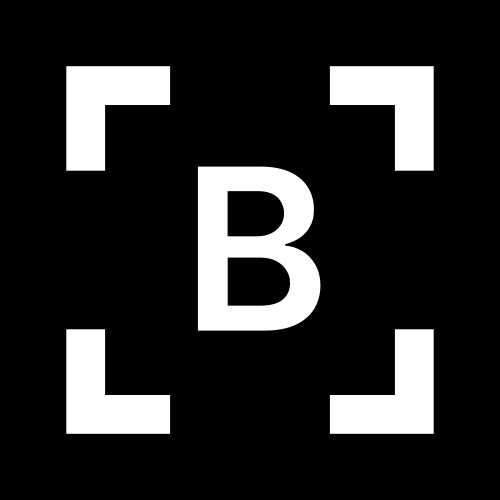

<p align="center">
  
</p>

<h1 align="center">Better SS</h1>

<p align="center">
  A fast, local-first screenshot and screen-recording toolkit for Windows.
</p>

<p align="center">
  <a href="LICENSE"></a>
  
  
</p>

Better SS combines precise screen capture, a floating preview, annotation, local
OCR, image export, screen recording, and simple video cutting in one native
Windows application. Captures and OCR stay on the computer: the app has no
accounts, analytics, cloud upload, or network-backed processing.

> Better SS is early-stage software. Builds are currently unsigned, and some
> capture paths rely on Windows-specific APIs and display behavior.

## Highlights

- Capture an area, visible window, display, or the entire multi-display desktop.
- Copy native DIB and PNG clipboard data and drag captures directly into other apps.
- Annotate with pen, highlighter, arrows, blur, mosaic, shapes, crop, and undo/redo.
- Extract text locally with Windows OCR.
- Export PNG, JPEG, PDF, TIFF, BMP, and GIF with size and quality controls.
- Record a display or application window to MP4/MOV using H.264 or H.265.
- Trim, split, ripple-delete, and re-export recordings in Better SS Split.
- Customize hotkeys, capture delay, preview behavior, appearance, storage, and startup.

## Requirements

- Windows 10 version 2004 (build 19041) or newer, or Windows 11
- A 64-bit PC
- [.NET 8 SDK](https://dotnet.microsoft.com/download/dotnet/8.0) for development
- PowerShell 5.1 or newer
- FFmpeg for recording and video editing (installed by the included setup script)

## Build from source

```powershell
git clone https://github.com/HarshRawat12/better-ss.git
cd better-ss
./scripts/setup-ffmpeg.ps1
dotnet run --project BetterSS/BetterSS.csproj
```

To create a self-contained x64 build:

```powershell
./build.ps1
```

The packaged application is written to `dist/BetterSS-release/BetterSS.exe`.
FFmpeg executables are downloaded directly from the Windows build provider and
verified against its published SHA-256 checksum; they are not committed to Git.

Capture sounds are also excluded because the development audio does not have a
documented redistribution license. The app still builds without audio, and you
can choose your own sound in **Preferences → Sound**.

## How it works

Better SS is a code-first WPF application: the interface is assembled in C# rather
than XAML. WinForms is used only for monitor discovery and the system-tray icon.
Native Win32 interop handles physical-pixel capture, global hotkeys, window
enumeration, clipboard formats, display coordinates, and capture exclusion.

| Area | Main implementation | Responsibility |
| --- | --- | --- |
| App lifecycle | `App.cs` | Tray process, single-instance guard, capture coordination |
| Capture | `Capture.cs`, `Native.cs`, `WindowPicker.cs` | Frozen desktop, selection overlays, display/window capture |
| Preview | `PreviewWindow.cs`, `CaptureAnimationWindow.cs` | Floating thumbnail, drag-and-drop, capture animation |
| Editing | `EditorWindow.cs`, `CropOverlay.cs`, `ImageEffects.cs` | Non-destructive edit state, annotations, crop, filters |
| OCR and export | `OcrService.cs`, `ExportService.cs` | Windows OCR and six image output formats |
| Video | `VideoRecordingWindow.cs`, `VideoCutService.cs` | FFmpeg capture, pause segments, probing, cutting, encoding |
| Preferences | `Settings.cs`, `PreferencesWindow.cs` | JSON settings, normalization, per-user startup |

See [Architecture](docs/ARCHITECTURE.md) for the capture and recording flows,
design boundaries, state locations, and testing strategy.

## Project layout

```text
BetterSS/                 Application source and assets
  Assets/                 Logo and optional local capture audio
  Tools/                  FFmpeg license and locally downloaded executables
docs/                     Architecture and privacy documentation
scripts/                  Contributor setup scripts
website/                  Static product website
build.ps1                 Self-contained Windows publish script
generate-assets.ps1       SVG-to-ICO asset generator
```

## Verification

```powershell
# Compile
dotnet build BetterSS/BetterSS.csproj -c Release

# Package, then run the built-in regression suite
./build.ps1 -Test

# Focused editor and video checks
dotnet run --project BetterSS/BetterSS.csproj -- --editor-test
dotnet run --project BetterSS/BetterSS.csproj -- --video-cutter-test
```

The full `--live-capture-test` suite is opt-in because it briefly opens test
windows, moves the pointer, and exercises real displays. Test output is written
to ignored local directories.

## Known limitations

- Recording currently captures video without microphone or system audio.
- HDR color management, protected content, and scrolling capture are unsupported.
- Window capture may temporarily bring the selected window forward.
- The default shortcut can conflict with other applications.
- Unsigned local builds can trigger Windows reputation warnings.

## Contributing

Issues and pull requests are welcome. Start with [CONTRIBUTING.md](CONTRIBUTING.md)
and please follow the [Code of Conduct](CODE_OF_CONDUCT.md). For vulnerabilities,
use the private process in [SECURITY.md](SECURITY.md).

## License

Better SS source code is released under the [MIT License](LICENSE). FFmpeg and
other separately licensed components remain under their own terms; see
[Third-party notices](THIRD_PARTY_NOTICES.md).
