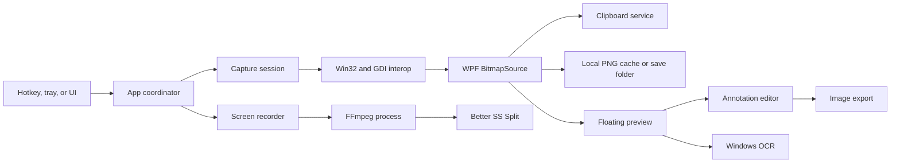

# Architecture

Better SS is a Windows desktop utility built with C# 12, WPF, and .NET 8. The
application is deliberately local-first: screenshots, settings, OCR input, and
video media stay on the user's computer.

## System overview

## Runtime model

`App.Main` creates the WPF application, enforces a per-user single instance with
a named mutex, initializes the tray icon, loads normalized settings, registers
the global hotkey, and opens the first-run guide when required. Closing ordinary
windows does not stop the process; quitting from the tray performs cleanup and
unregisters the hotkey.

The UI is constructed in C# rather than XAML. `UI.cs` centralizes reusable
controls, brushes, typography, surfaces, and native frame styling. WPF owns the
dispatcher and window lifecycle; WinForms is limited to `NotifyIcon`, `Screen`,
and a few standard dialogs.

## Screenshot pipeline

1. `App.BeginCapture` resolves the chosen mode and starts a `CaptureSession`.
2. `Native.Capture` takes one physical-pixel snapshot of the virtual desktop.
3. A borderless `CaptureOverlay` is placed on every display and shows the
   relevant slice of that frozen bitmap.
4. Pointer coordinates are converted between WPF device-independent units and
   physical desktop pixels. Selection state remains in physical pixels.
5. The selected rectangle becomes a `BitmapSource` and is copied through
   `ClipboardService` as both DIB and PNG.
6. The image is saved or cached locally, animated to a `PreviewWindow`, and
   offered for editing, OCR, export, pinning, or drag-and-drop.

Freezing the desktop at session start keeps a multi-monitor selection internally
consistent. It also means changes occurring after capture mode opens are not
present in the resulting image.

## Native boundary

`Native.cs` contains P/Invoke declarations and Windows-specific behavior:

- GDI screen capture and physical-pixel bitmap conversion
- Global hotkey registration
- Visible-window enumeration and activation
- Desktop Window Manager frame and cloaking queries
- Monitor-aware placement and DPI conversion
- `SetWindowDisplayAffinity` capture exclusion
- OLE drag-and-drop helpers and shell folder opening

Keeping those calls in one module makes platform assumptions easier to audit.
The application manifest establishes per-monitor DPI awareness before an HWND is
created.

## Editing model

`EditorWindow` holds a base bitmap plus vector-like annotation elements. Pen,
highlighter, arrows, shapes, blur, and mosaic share undoable editor state. Crop is
previewed by `CropOverlay` and becomes part of the edit history only when applied.
Export flattens the current composition without mutating the original captured
bitmap, allowing crop and filter operations to be undone.

`ExportService` implements encoders for PNG, JPEG, TIFF, BMP, and GIF, plus a
minimal raster-image PDF writer. OCR uses `Windows.Media.Ocr` and requires an OCR
language installed in Windows.

## Video pipeline

`ScreenRecorder` starts FFmpeg as a child process and passes arguments as an
argument list rather than a shell command. Display recording uses physical
desktop coordinates. Application recording uses FFmpeg's Windows Graphics
Capture filter and the chosen window handle.

Pausing closes the current recording segment. Resuming starts another segment,
and stopping joins compatible segments with FFmpeg's concat demuxer. Temporary
segments are created next to the requested output so the final move stays on the
same volume; failed finalization preserves recoverable data when possible.

Better SS Split probes media with `ffprobe`, maintains a one-track clip document,
generates a lightweight H.264 preview, and re-encodes selected ranges for accurate
cut boundaries. It never overwrites the source file.

## Persistence and privacy

| Data | Default location |
| --- | --- |
| Settings | `%LOCALAPPDATA%\Better SS\settings.json` |
| Screenshots | `%USERPROFILE%\Pictures\Better SS` |
| Drag cache | `%LOCALAPPDATA%\Better SS\DragCache` |
| Recording temporary segments | Beside the selected output file |

There is no application server or database. See [Privacy](PRIVACY.md) for the
complete data-handling summary.

## Test strategy

Regression checks are executable modes in the desktop application because the
most important behavior crosses WPF, Win32, the clipboard, displays, and real
input devices.

- `--self-test` exercises export formats, OCR, clipboard round trips, settings,
  startup isolation, annotation rendering, and interaction paths.
- `--editor-test` focuses on editor state and rendered output.
- `--video-cutter-test` creates synthetic media and validates cut/export behavior.
- `--live-capture-test` runs opt-in integration checks against actual displays and
  windows.

CI performs a Release compilation on Windows. Full UI verification remains a
local, explicit action because hosted runners do not provide representative
desktop hardware or interactive sessions.
